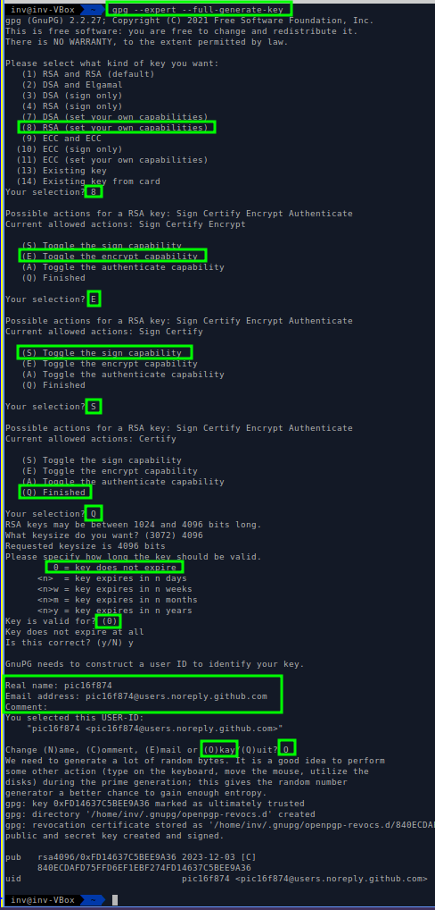
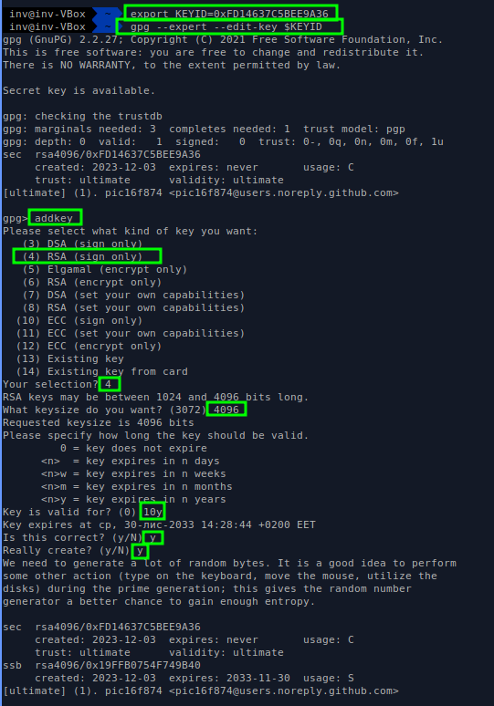
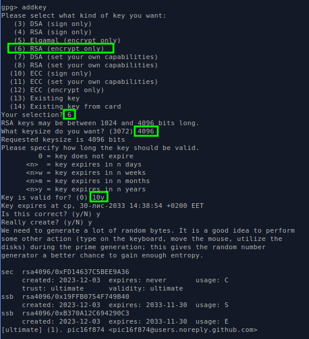
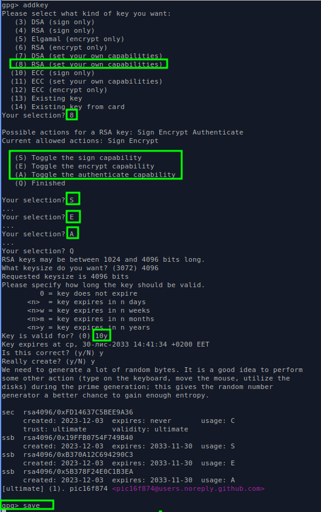
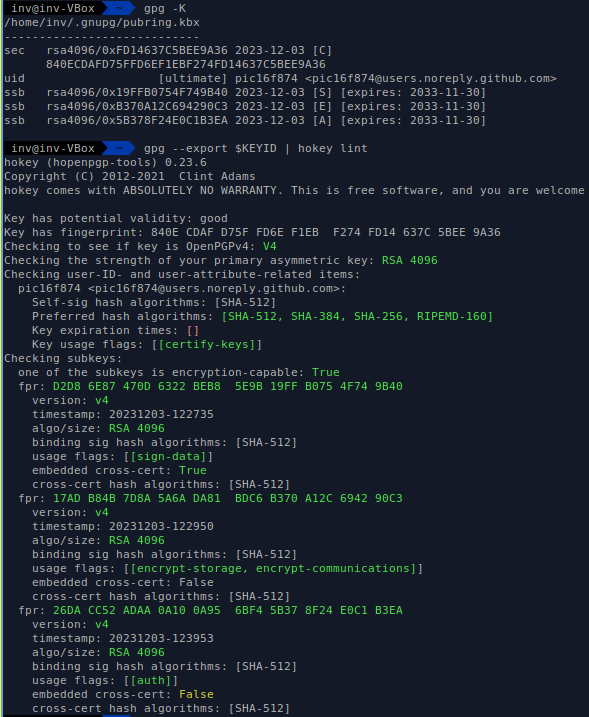

# 

[Ubuntu GnuPG How-to ](https://help.ubuntu.com/community/GnuPrivacyGuardHowto)

`sudo apt-get install gpa`

<details><summary><b>Step 1: Create new folder, set var, copy gpg.conf</b></summary>

```bash
mkdir -p         $HOME/.gnupg-yubikey
export GNUPGHOME=$HOME/.gnupg-yubikey
chmod 600 $GNUPGHOME/gpg.conf
```
</details>

<details><summary><b>Step 2: Generate master gpg key in expert mode</b></summary>

Generate master key
`gpg --expert --full-generate-key`



</details>

##### non-interactive example

<details><summary><b>Step 3: Set KEYID env var</b></summary>

`export KEYID=0xFD14637C5BEE9A36`
</details>

<details><summary><b>Step 4: Edit key - add <i>sign</i> sub-key </b></summary>

Edit key - Add sign key

`gpg --expert edit-key $KEYID`



</details>

<details><summary><b>Step 5: Edit key - add <i>encrypt</i> sub-key </b></summary>



</details>


<details><summary><b>Step 6: Edit key - add <i>auth</i> sub-key </b></summary>


</details>


<details><summary><b>Step 8: Verify your key generation</b></summary>


</details>


<details><summary><b>Step 9: Backup-restore your key </b></summary>

1. Export keys
   Replace $KEYID with your GPG key ID:
```bash
gpg --armor --export  $KEYID  > $KEYID.pub.asc
gpg --armor --export-secret-keys $KEYID > $KEYID.priv.asc
gpg --armor --export-secret-subkeys $KEYID > $KEYID.sub_priv.asc
gpg --export-ownertrust > ownertrust.txt
gpg --armor --gen-revoke $KEYID > REVOKE-$KEYID.asc
```
2. Import keys
```bash
gpg --import $KEYID.pub.asc
gpg --import $KEYID.priv.asc
gpg --import $KEYID.sub_priv.asc
gpg --import-ownertrust ownertrust.txt
```
3. Ultimately trust the imported key:
```
gpg --edit-key $KEYID
gpg> trust
Your decision? 5
```

</details>


<details><summary><b>Step 10: Install YubiKey software and packages </b></summary>

## Install YubiKey software and packages
</details>


<details><summary><b>Step 11: Configuring the YubiKey(s) </b></summary>

## Configuring the YubiKey(s)
</details>


We use the YubiKey Manager to configure the YubiKey(s).
## Configure your primary YubiKey

In the following, we assume that the second configuration slot of your YubiKey is unconfigured and free.

    1. Plug in the primary YubiKey.
    2. Enter ykman info in a command line to check its status.
    3. Enter ykman otp info to check both configuration slots. By default, “Slot 1” is already “programmed.”
    4. Set up slot 2 for the challenge-response mode: ykman otp chalresp -t -g 2. The parameters are “require touching the physical button to generate the response” (-t) (optional) and “generate a random secret” (-g).

You should see output similar to the following:
Using a randomly generated key: abcd…6789
Program a challenge-response credential in slot 2? [y/N]:
Press y to set up slot 2.
Done

Since we want (optionally) to store the same secret in another YubiKey or make a backup of it (recommended) do not close ykman at this point.


## Configure additional YubiKeys (optional)

For any additional YubiKey, you need to configure the same secret (the “randomly generated key”):

    1. Plug in another YubiKey.
    2. Enter ykman info to check its status.
    3. Enter ykman otp info to check both configuration slots. By default, “Slot 1” is already “programmed.”
    4. Set up slot 2 for the challenge-response mode: ykman otp chalresp -t 2 [secret]. This time, you need to enter the secret key (“abcd…6789”) instead of using the parameter “-g.”

You should see output similar to the following:

Program a challenge-response credential in slot 2? [y/N]:

Press y to set up slot 2.

Done.

Repeat this for every other YubiKey you want to use as a backup.

## Backup your secret (strongly recommended)

If you do not have a second YubiKey and/or want to program a new/backup YubiKey at a later stage you can also backup your secret key.This can be done by saving or writing down your secret key (“abcd…6789”) and storing it somewhere safe. Simply repeat the “Configure additional YubiKeys” steps with the secret key from your backup and you can use another YubiKey with the same KeePassXC database.

    Reminder: if you do not have a second Yubikey configured with the same secret and do not backup your secret key you will lose access to your database if your Yubikey breaks or get lost!


####################################################
sudo apt install yubikey-manager

$ ykman info
Device type: YubiKey 5C NFC
Serial number: 23420280
Firmware version: 5.4.3
Form factor: Keychain (USB-C)
Enabled USB interfaces: OTP, FIDO, CCID
NFC transport is enabled.

Applications	USB    	NFC    
FIDO2       	Enabled	Enabled
OTP         	Enabled	Enabled
FIDO U2F    	Enabled	Enabled
OATH        	Enabled	Enabled
YubiHSM Auth	Enabled	Enabled
OpenPGP     	Enabled	Enabled
PIV         	Enabled	Enabled

~  $ ykman otp info
Slot 1: programmed
Slot 2: empty
~  $

- transfer subkeys to Yubikey 
- safely cleanup gpg


---
<details><summary><b> --- </b></summary></details>
