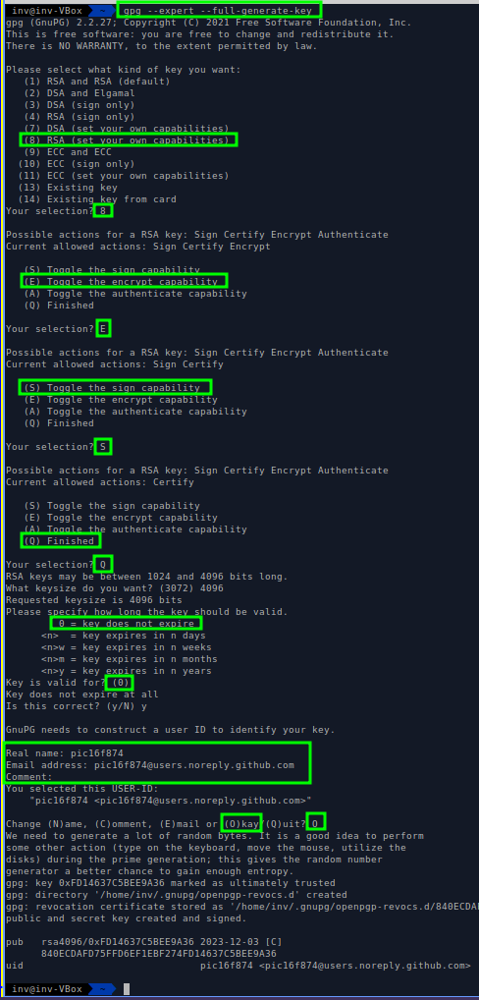
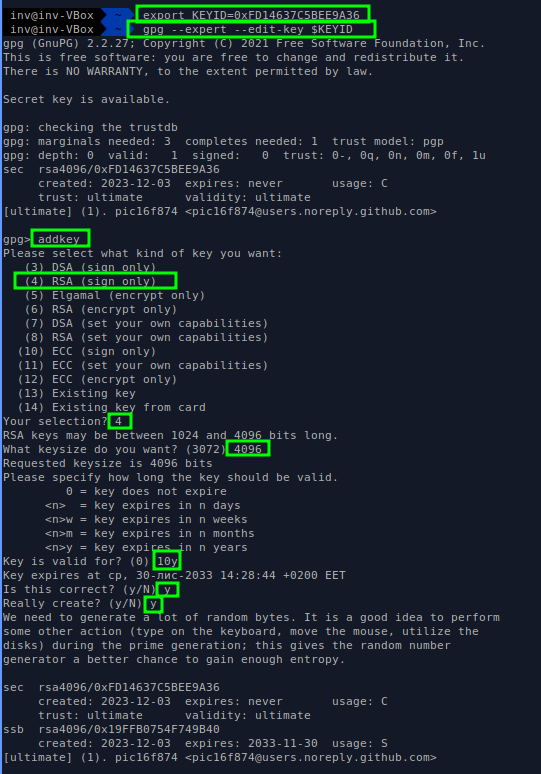
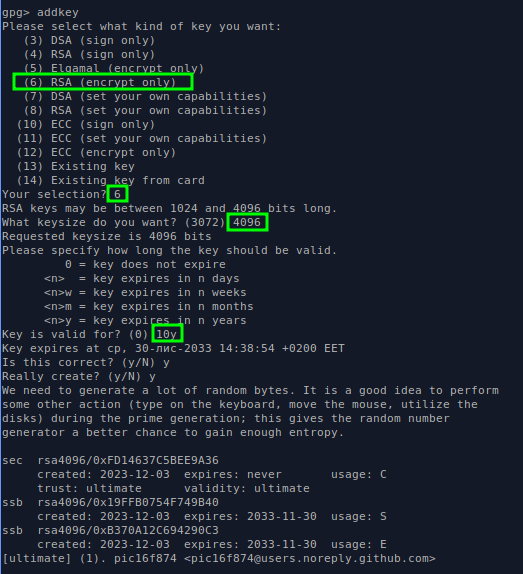
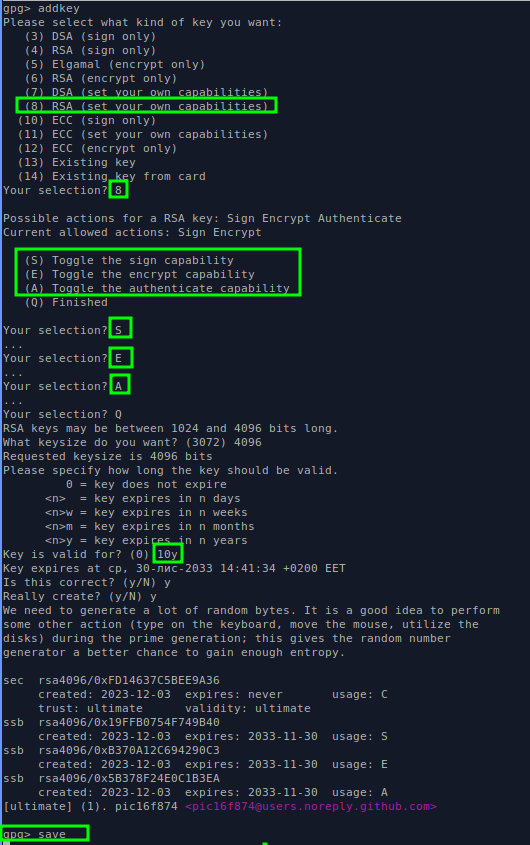
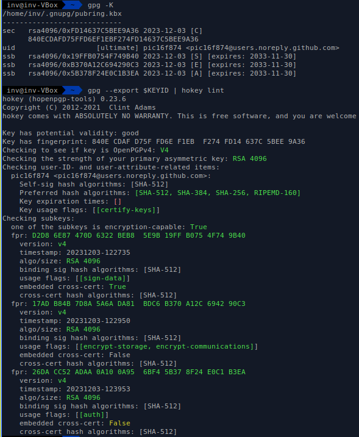

# 

[Ubuntu GnuPG How-to ](https://help.ubuntu.com/community/GnuPrivacyGuardHowto)

`sudo apt-get install gpa`

<details><summary><b>Step 1: Create new folder, set var, copy gpg.conf</b></summary>

`mkdir -p         $HOME/.gnupg-yubikey` 

`export GNUPGHOME=$HOME/.gnupg-yubikey`

`chmod 600 $GNUPGHOME/gpg.conf`

</details>

<details><summary><b>Step 2: Generate master gpg key in expert mode</b></summary>

Generate master key
`gpg --expert --full-generate-key`



</details>

##### non-interactive example

<details><summary><b>Step 3: Set KEYID env var</b></summary>

`export KEYID=0xFD14637C5BEE9A36`
</details>

<details><summary><b> Step 4: Edit key - add <i>sign</i> sub-key </b></summary>



</details>

<details><summary><b> Step 5: Edit key - add <i>encrypt</i> sub-key </b></summary>



</details>


<details><summary><b> Step 6: Edit key - add <i>auth</i> sub-key </b></summary>


</details>

<details><summary><b> Step 7: Verify your key generation</b></summary>



</details>

<details><summary><b>Step 8: Backup-restore your key </b></summary>

1. Export keys
Replace $KEYID with your GPG key ID:
```bash
gpg --export --armor  $KEYID  > $KEYID.pub.asc
gpg --export-secret-keys --armor $KEYID > $KEYID.priv.asc
gpg --export-secret-subkeys --armor $KEYID > $KEYID.sub_priv.asc
gpg --export-ownertrust > ownertrust.txt
```
2. Import keys
```bash
gpg --import $KEYID.pub.asc
gpg --import $KEYID.priv.asc
gpg --import $KEYID.sub_priv.asc
gpg --import-ownertrust ownertrust.txt
```
3. Ultimately trust the imported key:
```
gpg --edit-key $KEYID
gpg> trust
Your decision? 5
```

</details>

---
<details><summary><b> --- </b></summary></details>

